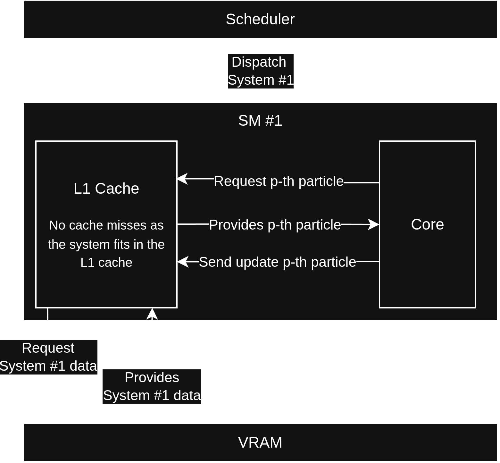

# GPU Course Project
## Multi-System simulation for verification of Statistical Physics
###### Léo BECHET


---
layout: center
---

# Idea

- Simulate multiple systems on a GPU
- Optimize for sizes that fit on L1 cache
- Modular support for interactions, boundary conditions and integrators
- Async transfer of data for overlap between GPU computation and D-H transfers

---


# Motivation 

<div>
    <div class="image-container">
        
    </div>
</div>

 

<style scoped>
  .image-container {
    display: flex;
    justify-content: space-between;
    margin:auto;
  }

  img {
    width: 50%;
    height: auto;
    margin: auto
  }

</style>


---


# Async transfer

<br>
<br>
<br>
<br>
<br>
```
| N Kernel launch and run | D-D copy | N+1 kernel launch and run | 
+-------------------------+----------+--------------+------------+-
                                     | D-H transfer |
                                     ################
                                     ^ Overlap between transfer and computation
                                       Transfer is non-blocking
```


---


# Available integrators :

<br>
<br>

- ## **Euler** :
  - Don't use it it's bad, used it for starter, it's not stable

<br>

- ## **Leapfrog** :
  - Current standard
  - Works well for now
  - Allows for retrieval of the laws of statistical physics

<br>


- ## **RK4(5)**
  - Planned but not yet implemented


---

# Available interactions :

<br>
<br>

- ## **Ideal Gas**

<br>

- ## **Simple $\frac{1}{r²}$ Repulsive force**
  - Might be a bit too strong when too close sometimes

<br>

- ## **Gravitational Interactions**


